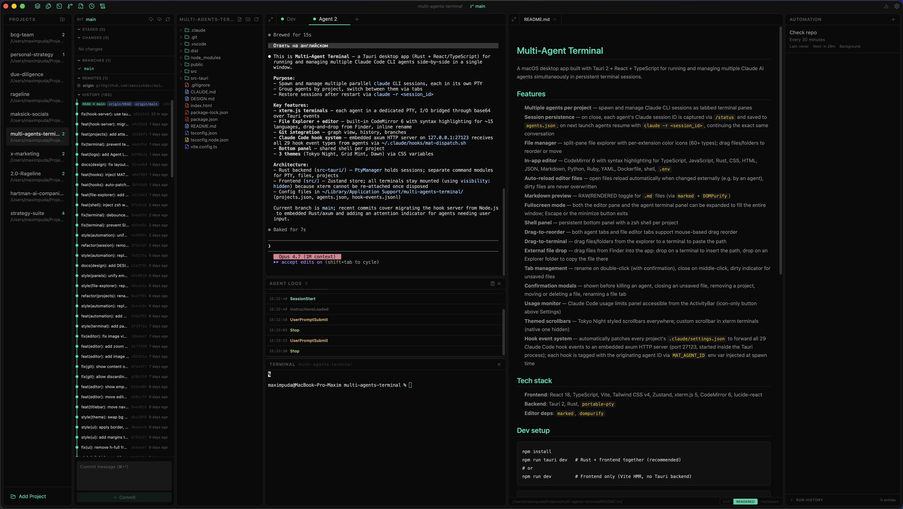
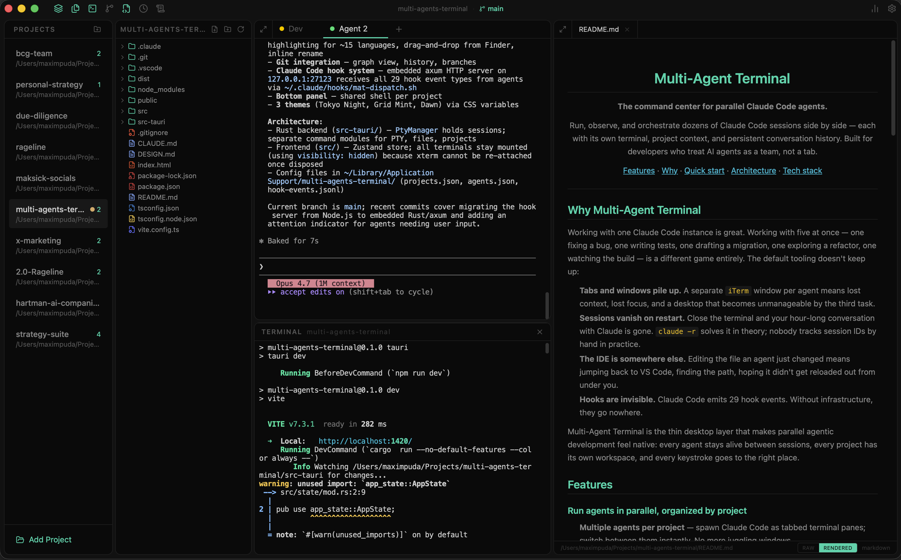
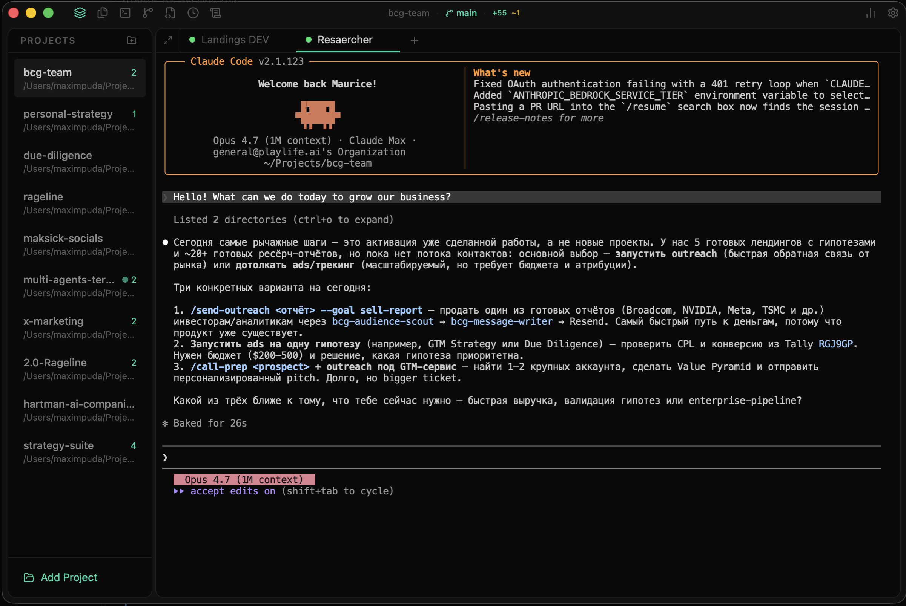

<div align="center">

# Multi-Agent Terminal

**The command center for parallel Claude Code agents.**

Run, observe, and orchestrate dozens of Claude Code sessions side by side — each with its own terminal, project context, and persistent conversation history. Built for developers who treat AI agents as a team, not a tab.

[Features](#features) · [Why](#why-multi-agent-terminal) · [Quick start](#quick-start) · [Architecture](#architecture) · [Tech stack](#tech-stack)

<br>



</div>

---

## Why Multi-Agent Terminal

Working with one Claude Code instance is great. Working with five at once — one fixing a bug, one writing tests, one drafting a migration, one exploring a refactor, one watching the build — is a different game entirely. The default tooling doesn't keep up:

- **Tabs and windows pile up.** A separate `iTerm` window per agent means lost context, lost focus, and a desktop that becomes unmanageable by the third task.
- **Sessions vanish on restart.** Close the terminal and your hour-long conversation with Claude is gone. `claude -r` solves it in theory; nobody tracks session IDs by hand in practice.
- **The IDE is somewhere else.** Editing the file an agent just changed means jumping back to VS Code, finding the path, hoping it didn't get reloaded out from under you.
- **Hooks are invisible.** Claude Code emits 29 hook events. Without infrastructure, they go nowhere.

Multi-Agent Terminal is the thin desktop layer that makes parallel agentic development feel native: every agent stays alive between sessions, every project has its own workspace, and every keystroke goes to the right place.

## Features

### Run agents in parallel, organized by project
- **Multiple agents per project** — spawn Claude Code as tabbed terminal panes; switch between them instantly. No more juggling windows.
- **Project-scoped workspaces** — each project carries its own agents, file tree, shell, and editor state. Switching projects switches everything.
- **Drag-to-reorder tabs** — both agent tabs and editor tabs reorder via mouse drag, like a browser.
- **Attention indicator** — agents that need your input surface a visible cue on the project list, so nothing waits silently in a background tab.

### Sessions that survive restarts
- **Conversation persistence** — on quit, each agent's Claude session ID is captured via `/status` and saved. On next launch, agents resume with `claude -r <session_id>` and continue the exact same conversation.
- **No raw scrollback storage** — Claude itself rehydrates the UI; the app stays lean and never pretends to know more than it does.
- **Graceful exit flow** — close confirmation, parallel session-ID capture across all agents, atomic save before shutdown.

### A real IDE, built in
- **File explorer** — split-pane tree with 60+ language-specific icons (TypeScript blue, Rust red, JSON yellow, …). Inline rename, context menu, drag-to-move with confirmation.
- **CodeMirror 6 editor** — syntax highlighting for TypeScript, JavaScript, Rust, Python, CSS, HTML, JSON, YAML, Markdown, Ruby, Dockerfile, shell, `.env`. Tokyo Night theme. Cmd+S saves.
- **Auto-reload on external change** — when an agent edits an open file, the editor refreshes automatically. Dirty buffers are never overwritten.
- **Markdown preview** — RAW/RENDERED toggle for `.md` files via `marked` + `DOMPurify`.
- **Fullscreen mode** — expand the editor or terminal panel to fill the window; Escape returns.
- **Drag-to-terminal** — drag a file from the explorer into any terminal to paste its absolute path. Drop from Finder works too.

### A shell that's always there
- **Persistent bottom shell** — one zsh per project, mounted permanently so xterm never reinitializes. Toggle from the title bar.
- **UTF-8 ready** — inherits `LANG`/`LC_ALL`/`LC_CTYPE` so multi-byte input works correctly in zsh ZLE.

### First-class Claude Code hooks
- **All 29 events captured** — every project's `.claude/settings.json` is non-destructively patched on startup to forward every hook event.
- **Embedded HTTP server** — an axum server on `127.0.0.1:27123` runs inside the Tauri process. No Node.js sidecar, no external daemon.
- **Per-agent attribution** — each PTY spawn injects `MAT_AGENT_ID` so hook events resolve back to the originating agent — even when session IDs change.
- **Append-only event log** — `hook-events.jsonl` is the source of truth; the frontend polls it for live UI updates.

### Polish where it matters
- **Three themes** — Tokyo Night, Grid Mint, Dawn. Every component obeys the unified design system; no hard-coded colors.
- **Custom xterm scrollbar** — the native one is hidden; a 6px themed scrollbar tracks each terminal with no React re-renders.
- **Confirmation modals everywhere they belong** — kill an agent, close a dirty file, delete a project, move or rename a file. No surprise data loss.
- **Usage panel** — Claude Code usage limits one click away from the title bar.
- **Drag region title bar** — 32px chromeless bar with project name, panel toggles, and inline git info.

## Screenshots

<table>
  <tr>
    <td width="50%">
      <a href="./docs/screenshots/workspace.png">
        
      </a>
      <p align="center"><sub><b>One workspace.</b> File tree, live terminal output and a rendered preview, side by side.</sub></p>
    </td>
    <td width="50%">
      <a href="./docs/screenshots/agent-session.png">
        
      </a>
      <p align="center"><sub><b>An agent at work.</b> Each tab is a full Claude Code session — resume the same conversation across launches.</sub></p>
    </td>
  </tr>
</table>

## Quick start

```bash
# Clone and install
npm install

# Run the full Tauri app (Rust + frontend)
npm run tauri dev

# Or run only the frontend (Vite HMR, no Tauri backend)
npm run dev

# Production build
npm run tauri build
```

Sanity checks:

```bash
npx tsc --noEmit                                    # type-check
cargo check --manifest-path src-tauri/Cargo.toml   # rust check
```

### Requirements

- macOS (the app is a Tauri 2 build targeting darwin)
- Node.js 18+
- Rust toolchain (`rustup`, stable)
- `claude` CLI installed and discoverable from your login shell

## Tech stack

- **Frontend** — React 18, TypeScript, Vite, Tailwind CSS v4, Zustand, xterm.js 5, CodeMirror 6, lucide-react
- **Backend** — Tauri 2, Rust, `portable-pty`, `axum`
- **Editor extras** — `marked`, `dompurify`

## Architecture

The system is intentionally thin. Three things keep it that way:

1. **PTY in Rust.** Each agent and each shell is a real pseudo-terminal owned by `portable-pty`. Output is read in 4 KB chunks and emitted as a Tauri `pty-output` event. Input is base64-encoded UTF-8 written directly to the PTY.
2. **xterm.js never re-mounts.** Terminals are mounted once and stay mounted forever — closed panels use `visibility: hidden` or `height: 0`, never `display: none`. Reopening is instant; nothing reinitializes.
3. **Conversation state lives in Claude.** The app stores session IDs, not transcripts. Resume = `claude -r <session_id>`. The terminal redraws itself from the source of truth.

```
src/                    React + TypeScript frontend
  components/           Sidebar, FileExplorer, Editor, MainArea, Terminal, BottomPanel
  hooks/                Session persistence, PTY events, hook polling, file watching
  lib/                  ptyManager, tauri wrappers, claudeHooks, file icons, drag
  store/                Zustand store
src-tauri/              Tauri 2 + Rust backend
  src/
    commands/           pty_commands, project_commands, file_commands
    hook_server.rs      embedded axum HTTP server (port 27123, POST /hook)
    pty/                session, manager, reader
    state/              app_state
```

## Configuration

Runtime config lives in `~/Library/Application Support/multi-agents-terminal/`:

| File | Purpose |
| --- | --- |
| `projects.json` | Saved projects (path, name, ordering) |
| `agents.json` | Saved agents — tab order, project association, Claude `session_id` |
| `hook-events.jsonl` | Append-only log of every Claude Code hook event |

The hook dispatch script is auto-created at `~/.claude/hooks/mat-dispatch.sh` on first launch — pure bash, no Node.js.

## Design system

All UI work follows the unified design system in [`DESIGN.md`](./DESIGN.md). Colors via CSS variables only (`var(--c-bg)`, `var(--c-accent)`, …), three switchable themes, fixed 32px headers, standard `text-xs` / `text-sm` sizing, `lucide-react` icons only. Read it before touching components.

## Conventions

- **English only** in code, comments, UI labels, commit messages.
- **Conventional Commits** for every commit (`feat`, `fix`, `refactor`, …, with optional scope).
- **No new files** unless necessary. Extend the existing structure.

## Status

Active development. Issues and pull requests welcome — please open an issue first for anything beyond a small fix so we can align on direction.
